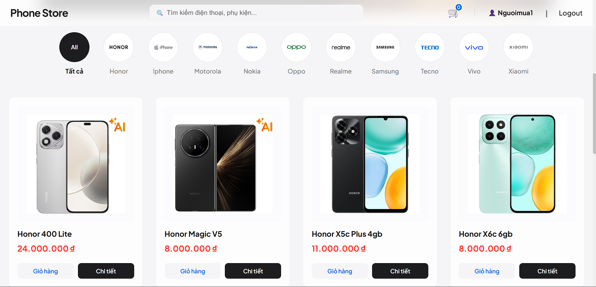
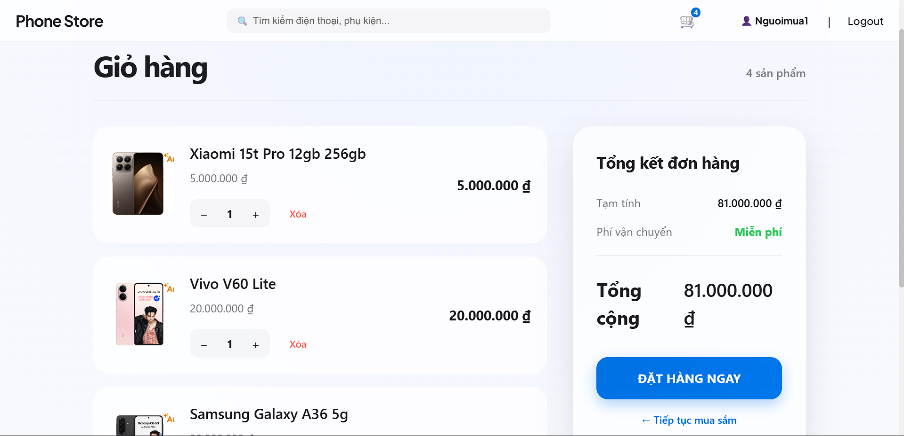

# 📱 Hệ Thống Quản Lý Cửa Hàng Điện Thoại

Một giải pháp thương mại điện tử Full-stack hiện đại dành cho thiết bị di động, được xây dựng bằng **Spring Boot** và **React**. Hệ thống mang lại trải nghiệm mượt mà, hiệu năng cao và giao diện người dùng tinh tế.

---

## 📋 Mục lục
- [🚀 Tính năng chính](#-tính-năng-chính)
- [🛠️ Công nghệ sử dụng](#️-công-nghệ-sử-dụng)
- [📦 Hướng dẫn cài đặt](#-hướng-dẫn-cài-đặt)
- [⚙️ Cấu hình hệ thống](#️-cấu-hình-hệ-thống)
- [📁 Cấu trúc dự án](#-cấu-trúc-dự-án)
- [📸 Hình ảnh giao diện](#-hình-ảnh-giao-diện)
- [👤 Tác giả](#-tác-giả)

---

- 🔐 **Xác thực người dùng**: Đăng ký và Đăng nhập bảo mật.
- 📱 **Danh mục sản phẩm Dynamic**: Duyệt danh sách các thiết bị di động được lấy trực tiếp từ database.
- 🔄 **Đồng bộ Assets thông minh**: Tự động quét và nạp hàng loạt sản phẩm từ thư mục ảnh cục bộ (`assets/phone`) vào hệ thống.
- 📦 **Quản lý tồn kho**: Theo dõi và cập nhật số lượng hàng (Stock) chính xác cho từng loại máy.
- 🔍 **Chi tiết sản phẩm**: Xem thông số kỹ thuật đầy đủ, hình ảnh và mô tả chuẩn tiếng Việt.
- 🛒 **Giỏ hàng hiện đại**: 
    - Thêm sản phẩm nhanh chóng, tự động gộp và cập nhật số lượng.
    - Hiển thị hình ảnh sản phẩm trực quan nhờ hệ thống Image Resolver.
- 📦 **Đặt hàng**: Quy trình thanh toán đơn giản, tự động tính tổng tiền.
- 🛠️ **Quản trị hệ thống**: 
    - Quản lý sản phẩm (Thêm, Xóa, Sửa, Dọn dẹp).
    - Đồng bộ dữ liệu assets mạnh mẽ.
    - Thống kê tổng quan đơn hàng và người dùng.

---

## 🛠️ Công nghệ sử dụng

### Frontend
- **Framework**: React 19 (Vite)
- **Styling**: Vanilla CSS3 (Modern Flexbox/Grid)
- **State Management**: React Context API
- **API Client**: Axios

### Backend
- **Framework**: Spring Boot 3.x / Hibernate 6+
- **Language**: Java 21
- **Database**: MySQL 8.0 (UTF-8 support)
- **ORM**: Spring Data JPA

---

## 📦 Hướng dẫn cài đặt

Làm theo các bước sau để chạy dự án trên máy cục bộ của bạn.

### 1. Clone repository
```bash
git clone https://github.com/MinhKhang273z/phone-store-management.git
cd phone-store-management
```

### 2. Thiết lập cơ sở dữ liệu
- Tạo một database trong MySQL có tên là `phone_store`.
- Import script khởi tạo (nếu có):
```bash
mysql -u root -p phone_store < database/init.sql
```

### 3. Chạy Backend (Spring Boot)
```bash
cd backend
./mvnw spring-boot:run
```

### 4. Chạy Frontend (React)
```bash
cd frontend
npm install
npm run dev
```

---

## ⚙️ Cấu hình hệ thống

### Kết nối cơ sở dữ liệu
Cập nhật file `backend/src/main/resources/application.properties` với thông tin của bạn:
```properties
spring.datasource.url=jdbc:mysql://localhost:3307/phone_store
spring.datasource.username=root
spring.datasource.password=123456
spring.jpa.hibernate.ddl-auto=update
```

### Hỗ trợ Docker
Dự án có sẵn file `docker-compose.yml` để thiết lập môi trường nhanh chóng:
```bash
docker-compose up -d
```

---

## 📁 Cấu trúc dự án

```text
phone-store-management/
├── backend/            # Ứng dụng Spring Boot
│   ├── src/main/java   # Mã nguồn Java
│   └── src/resources   # Cấu hình & Tài nguyên tĩnh
├── frontend/           # Ứng dụng React
│   ├── src/components  # Các thành phần giao diện tái sử dụng
│   ├── src/pages       # Các trang chính của ứng dụng
│   └── src/services    # Lớp dịch vụ gọi API
├── database/           # Các script khởi tạo SQL
└── docker/             # File cấu hình Docker
```

---

## 📸 Hình ảnh giao diện

<div align="center">
  <p><b>Trang chủ - Danh mục sản phẩm</b></p>
  
  
  <p><b>Giỏ hàng hiện đại</b></p>
  
</div>

---

## 👤 Tác giả

- **Minh Khang** - *Full Stack Developer* - [MinhKhang273z](https://github.com/MinhKhang273z)

---

<div align="center">
  <p>Nếu bạn thấy dự án này hữu ích, hãy tặng cho mình một ⭐ nhé!</p>
</div>
